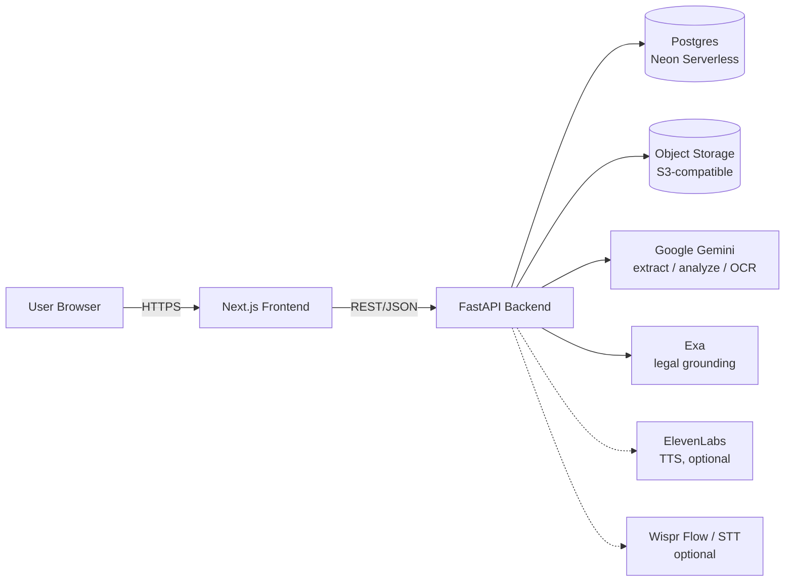

# Lexo

Lexo is an AI-powered assistant that helps everyday people in India understand rental and employment agreements before they sign them. A user uploads a document and receives a plain-language risk report — flagged clauses, missing protections, and action items — with legal citations grounded in real sources, never invented. Lexo is informational and explicitly not a substitute for a lawyer.

## Related docs

- [`SYSTEM_DESIGN.md`](./SYSTEM_DESIGN.md) — the detailed companion to this doc: data model, full API contract, security model, and deployment/phasing plan.
- [`PRD.md`](./PRD.md) — product requirements, personas, acceptance criteria.

This doc is a short architecture overview for onboarding. For anything beyond high-level shape, see `SYSTEM_DESIGN.md`.

## Status: target architecture vs. current scaffold

This document describes the **target architecture**. As of today, the backend (`lexo/backend`) has routers for `/api/upload`, `/api/analyze`, and `/api/voice`, but each returns a bare `501 Not Implemented`; there is no auth, database, or object storage wiring yet. The frontend (`lexo/frontend`) has no screens beyond a placeholder home page. Everything below is what the system is being built toward, not what exists today.

## High-level architecture

Backend is the only component that talks to Postgres, object storage, Gemini, and Exa — the frontend only ever calls the backend's REST API.

## Core pipeline

1. **Auth** — the user signs up or logs in; the backend issues a JWT session used on every subsequent request.
2. **Upload + validate** — the user picks a document type (`rental` or `employment`) and uploads a PDF or DOCX; the backend validates type/size.
3. **Store blob + `documents` row** — the raw file is written to object storage and a `documents` row (status `uploaded`) is created in Postgres. Storage happens here, at upload time — not at the end of the pipeline.
4. **Trigger analyze (async)** — the client separately calls the analyze endpoint, which kicks off processing as a background task and returns immediately; status moves to `processing`.
5. **Extract text** — digital PDFs/DOCX are parsed directly (`pdfplumber` / `python-docx`); scanned or low-text-density pages are instead rendered as images and passed to **Google Gemini's** multimodal input, which does extraction and OCR in a single pass — there is no separate OCR engine.
6. **Clause segmentation / risk / missing clauses / action items** — Gemini segments the text into typed clauses (per a `doc_type`-specific taxonomy), flags risky or unusual terms with a plain-language explanation and severity, diffs against a missing-clause checklist, and derives action items.
7. **Exa grounding** — for every flag and missing clause, the backend queries **Exa** for a real, retrievable source. If a trustworthy source is found, its citation is attached; if not, the item is explicitly labeled **"unverified / general principle"** rather than given a fabricated statute or section number. This is the core anti-hallucination guardrail — Exa only supplies sources to check the analysis against, it never generates the legal conclusion itself.
8. **Persist report + `risk_score`** — the completed report (flags, citations, missing clauses, action items, overall `risk_score`) is persisted to Postgres; status moves to `analyzed`.
9. **Client polls status / fetches report** — the frontend polls the document's status endpoint while processing, then fetches the full report once analysis completes.

## Components

- **Frontend** (`lexo/frontend`, Next.js) — auth pages, dashboard, upload flow, status view, report view.
- **Backend** (`lexo/backend`, FastAPI) — orchestrates the pipeline above; the only component with credentials to Postgres, object storage, Gemini, and Exa.
- **Google Gemini** — text/document understanding: extraction (incl. OCR of scanned pages via multimodal input), clause segmentation, risk analysis, missing-clause detection, voice Q&A answering.
- **Exa** — legal grounding only: retrieves real sources for citations; never asked to generate a legal conclusion.
- **Postgres (Neon Serverless)** — structured data: users, documents, reports, flags, citations, missing clauses, action items, refresh tokens. FE/BE host on Render; DB is Neon.
- **Object storage (S3-compatible)** — raw uploaded files, accessed only via the backend (short-lived signed URLs), never exposed directly to the client.
- **Voice (optional)** — ElevenLabs for text-to-speech; Wispr Flow (or a fallback) for speech-to-text. See below.

## Cross-cutting concerns

- **Auth & isolation** — every authenticated request carries a JWT; every query against documents/reports/flags/etc. is scoped to the requesting user, enforced at the service layer.
- **Grounded citations** — every citation shown to a user is either a real source retrieved via Exa or explicitly labeled unverified; Lexo never presents a fabricated statute or section number as real.
- **Disclaimer** — every report (API response and UI) carries an explicit "this is not legal advice" notice.
- **Privacy / delete** — deleting a document cascades to its blob, database row, and all associated report data; users can never read or delete another user's data.

## Optional voice path

Voice is additive and sits alongside the core upload → analyze → report path; it does not replace it. ElevenLabs can speak a report summary back to the user (text-to-speech). Spoken follow-up questions are transcribed (speech-to-text) and answered by Gemini, grounded only in the already-analyzed document and its existing citations.

**Caveat:** Wispr Flow's availability as a server-callable STT API is unconfirmed. The `/api/voice/*` contract is designed against a generic STT interface so it can be backed by Wispr Flow if it exposes a usable API, or a fallback (e.g. browser-based speech recognition) otherwise.

## Out of scope for this doc

See [`SYSTEM_DESIGN.md`](./SYSTEM_DESIGN.md) for: the full data model and ER diagram, the complete API contract, the Render deployment/environment inventory, and the phased build plan.
