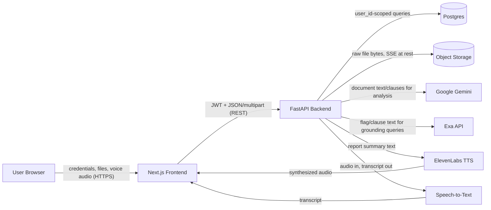

# Lexo — Security & Access

## 1. Document Control

| Field | Value |
|---|---|
| Status | **Draft** |
| Product | Lexo — AI legal-document assistant (rental & employment agreements, India) |
| Related docs | [`PRD.md`](./PRD.md) (product requirements, FRs/NFRs, acceptance criteria, open questions), [`SYSTEM_DESIGN.md`](./SYSTEM_DESIGN.md) (architecture, data model, full API contract, §7 Auth & Security, deployment) |
| Scope of this doc | A practical, implementer-facing security & access-control spec: who can access what, how auth works, data isolation/storage/secrets/CORS/rate limits, trust/disclaimer requirements, a lightweight threat model, and testable security acceptance criteria. |
| Not in scope | A full compliance/legal privacy policy, a penetration-test report, or a restatement of `SYSTEM_DESIGN.md`. Deep pipeline/API detail stays in `SYSTEM_DESIGN.md` and is referenced, not duplicated; product rationale stays in `PRD.md` and is referenced by FR/NFR number. |
| Target vs. implemented | This document describes the **target security model** as specified in `SYSTEM_DESIGN.md` §5–§7 and `PRD.md` §7.1/§8. **As of this draft, none of it is implemented.** [`lexo/backend/main.py`](../backend/main.py) has no CORS middleware, no auth, and no database wiring; `routes/upload.py`, `routes/analyze.py`, and `routes/voice.py` all return bare `501 Not Implemented`; [`models/schemas.py`](../backend/models/schemas.py) has only `Flag`/`Report`, no `User`/`Document`/`Citation`. The frontend has no screens beyond a placeholder home page — no token handling exists. Every control below is a requirement to build against, not a description of current behavior. |

## 2. Security Objectives

1. **Confidentiality of contracts** — uploaded rental/employment agreements are sensitive personal/financial documents; only the uploading user (and the backend processing pipeline on their behalf) may ever read them.
2. **Integrity of per-user isolation** — one user must never be able to read, modify, or delete another user's documents, reports, or account data, under any circumstance.
3. **Availability / abuse-cost control** — the system must bound its exposure to LLM/Exa cost abuse and credential-stuffing style load without requiring enterprise-grade infrastructure.
4. **Honest legal disclaimer** — the product must never let a user reasonably believe they received formal legal advice.

## 3. Trust Boundaries

| Boundary | Data crossing it | Trust note |
|---|---|---|
| Browser → Frontend | Credentials, uploaded files, voice audio | Frontend is public/untrusted client code; never place secrets here |
| Frontend → Backend | JWT access token, JSON/multipart bodies | Only trusted server component (backend) holds credentials to everything downstream |
| Backend → Postgres | `user_id`-scoped SQL queries | Backend is the only component with DB credentials |
| Backend → Object storage | Raw file bytes | Backend is the only component with storage credentials; client never gets a direct bucket URL |
| Backend → Gemini | Document text/clause content | Contract text leaves Lexo's infrastructure for analysis — see §7 |
| Backend → Exa | Flag/clause-derived search queries, not full documents | Used only for retrieving grounding sources, never given the legal conclusion to generate |
| Backend → ElevenLabs | Report summary text | Leaves infrastructure for TTS synthesis only |
| Backend → STT provider | Raw voice audio | Leaves infrastructure for transcription only |

## 4. Identity & Authentication

### 4.1 Flows

- **Signup** (`POST /api/auth/signup`) — creates a `users` row with a bcrypt/`passlib`-hashed password; no plaintext password is ever persisted or logged.
- **Login** (`POST /api/auth/login`) — verifies password hash, issues a JWT access token and a refresh token (stored server-side only as a hash in `refresh_tokens`, per `SYSTEM_DESIGN.md` §5).
- **Refresh** (`POST /api/auth/refresh`) — exchanges a valid refresh token for a new access token; rotates/validates against the hashed value in `refresh_tokens`.
- **Logout** (`POST /api/auth/logout`) — revokes (deletes/invalidates) the corresponding `refresh_tokens` row so the refresh token can no longer mint new access tokens.

### 4.2 Token lifetimes and storage

| Token | Lifetime | Server-side storage | Client-side storage |
|---|---|---|---|
| Access (JWT) | Short-lived, ~15 minutes (`SYSTEM_DESIGN.md` §7) | Not persisted (stateless JWT, signed with `JWT_SECRET`) | **Open Question** — see §13 |
| Refresh | Longer-lived | Hashed in `refresh_tokens` table, tied to `user_id`, revocable on logout | **Open Question** — see §13 |

**Open question (do not invent):** `FRONTEND_SPEC.md` §10/FE-OQ-6 has not decided whether tokens live in memory/`localStorage` (simpler, weaker against XSS) or an httpOnly cookie set by the backend (stronger, requires backend cookie-setting support not yet specified). This document does not resolve it — see §13.

### 4.3 Password hashing requirements

- Passwords hashed with `passlib`/bcrypt before storage; plaintext passwords must never be written to the database or to logs (see §6 logging redaction policy).
- Password comparison happens only via the hash-verification function — never via plaintext string comparison.

### 4.4 Decision to confirm — hackathon auth simplification vs. product auth model

`.cursor/rules/backend-fastapi.mdc` ("If auth is actually needed for the demo") recommends the minimal option — a hardcoded API key or a bare short-lived JWT with **no refresh tokens, roles, or password reset** — and says to ask before building beyond "is this request allowed at all." This is narrower than the auth model specified in `SYSTEM_DESIGN.md` §5/§7 and `PRD.md` §7.1 (full JWT access + hashed refresh token model with logout revocation).

This document follows **`SYSTEM_DESIGN.md`/`PRD.md` as the target model** (refresh tokens included), per the ground truth this doc is built against. **This is flagged as a decision to confirm before Phase 1 implementation, not a silent downgrade** — if the demo timeline requires the simpler hackathon-rule approach instead, that should be an explicit, documented decision (updating this section and `SYSTEM_DESIGN.md` §7 together), not an implicit substitution.

## 5. Authorization & Access Control

### 5.1 Resource ownership rule

Every resource (`documents`, `reports`, `flags`, `citations`, `missing_clauses`, `action_items`) belongs to exactly one `user_id`. Every read, write, and delete operation on these resources must be filtered by the authenticated requester's `user_id`, **enforced at the service layer**, not only the route layer (`SYSTEM_DESIGN.md` §7). There is no admin role, no cross-user sharing, and no multi-tenant concept in MVP — **single end-user role only**.

### 5.2 Endpoint access matrix

Compact view; full method/path/purpose detail lives in `SYSTEM_DESIGN.md` §6 — not restated here.

| Endpoint | Auth |
|---|---|
| `POST /api/auth/signup` | No |
| `POST /api/auth/login` | No |
| `POST /api/auth/refresh` | Refresh token (not access JWT) |
| `GET /health` | No |
| `POST /api/auth/logout` | Yes |
| `POST /api/upload` | Yes |
| `GET /api/documents` | Yes |
| `GET /api/documents/{id}` | Yes |
| `DELETE /api/documents/{id}` | Yes |
| `POST /api/analyze/{document_id}` | Yes |
| `GET /api/reports/{id}` | Yes |
| `POST /api/voice/transcribe` | Yes |
| `POST /api/voice/speak` | Yes |

### 5.3 Explicit rules

- No endpoint may return, modify, or delete a resource owned by a different `user_id`, regardless of whether the caller is authenticated as *some* valid user.
- A request for another user's `document_id` or `report_id` must behave as **not found** (404), never as a 403 that confirms the resource exists, and never as a 200 with leaked data.
- No admin console, no roles/permissions matrix, no org-level access exists or is planned for MVP (`PRD.md` §4 Non-Goals).

## 6. Data Protection

- **In transit:** all traffic is served over HTTPS; Render terminates TLS at the edge for both the frontend and backend web services (`SYSTEM_DESIGN.md` §7, §8). No endpoint should be reachable over plain HTTP in production.
- **At rest:**
  - Postgres (Render managed) holds all structured data, including `password_hash` and `token_hash` — never plaintext passwords or plaintext refresh tokens.
  - Object storage uses server-side encryption (SSE) for raw uploaded files (`SYSTEM_DESIGN.md` §3.3).
- **Blob access pattern:** the backend never returns a raw storage URL to the client. If the client needs direct access to a file, the backend issues a short-lived signed URL; by default, file bytes flow through the backend, not a client-facing bucket URL.
- **Logging redaction policy:** logs must never contain passwords (plaintext or hashed), access/refresh tokens, or full uploaded-document text. Log identifiers (`user_id`, `document_id`, event type, status) instead of payload content. This is a policy statement for implementers to enforce with each new log line, not an automated scanner requirement for MVP.

## 7. Privacy & Retention

- **Per-user history:** `GET /api/documents` and `GET /api/reports/{id}` return only the requesting user's own data (§5).
- **Right to delete:** `DELETE /api/documents/{id}` removes the object-storage blob, the `documents` row, and cascades to the associated `reports` row and all of its `flags`, `citations`, `missing_clauses`, and `action_items` — no orphaned rows, no orphaned blob (`SYSTEM_DESIGN.md` §7, `PRD.md` FR-29). A subsequent fetch of the deleted document/report must return not-found.
- **Third parties:** uploaded contracts are treated as sensitive/confidential documents. As part of normal product operation:
  - Document text/clauses are sent to **Google Gemini** for extraction, clause segmentation, risk analysis, and missing-clause detection.
  - Flag/clause-derived search queries (not full documents) are sent to **Exa** for citation grounding.
  - Report summary text is sent to **ElevenLabs** for text-to-speech.
  - Voice audio is sent to the **STT provider** for transcription.
  
  This is a factual description of data flow for implementers and users to be aware of — it is not a legal privacy policy and does not constitute legal advice about data-processing obligations.

## 8. API & Application Security

- **Input validation:** all external input is validated at the boundary — Pydantic schemas on the backend, typed parsing on the frontend. Upload specifically validates file type (`pdf`, `docx`) and enforces a size limit before accepting a file (`SYSTEM_DESIGN.md` §4 stage 1, `PRD.md` FR-8); exact size limit is an existing PRD open question (not restated here, see `PRD.md` §14).
- **Standard error shape:** errors returned to the client use FastAPI's default `{"detail": "..."}` shape; raw exceptions/stack traces must never reach the client — log the detail server-side and return a clean `HTTPException` (`.cursor/rules/backend-fastapi.mdc`).
- **CORS policy:** `allow_origins` is an explicit list of known frontend origins (`http://localhost:3000` in dev, the deployed frontend URL once known) — never `["*"]` paired with `allow_credentials=True`. **Current state:** `lexo/backend/main.py` has no CORS middleware configured at all yet — this must be added before any authenticated frontend integration works.
- **Rate limiting:** upload and analyze endpoints must be rate-limited per user to bound LLM/Exa cost exposure and abuse (`SYSTEM_DESIGN.md` §7, `PRD.md` NFR). **Concrete thresholds are not decided — see PRD OQ-3.** Do not invent numbers; implement against a threshold that is easy to change (e.g. a config value), not hardcoded per-route logic.
- **Dependency/secrets hygiene:** secrets (`JWT_SECRET`, `DATABASE_URL`, `GEMINI_API_KEY`, `EXA_API_KEY`, `ELEVENLABS_API_KEY`, `WISPR_API_KEY`/STT credentials, S3 credentials) are read from `.env` only, never hardcoded in source, never committed, never echoed into logs or error responses (workspace rule `general.mdc`; `SYSTEM_DESIGN.md` §8).

## 9. Trust & Product Safety (Non-Auth)

- **Citation grounding as a safety control:** every legal citation shown to a user must come from a real source retrieved via Exa; if no reliable source is found, the item is explicitly labeled **"unverified / general principle"** rather than given a fabricated statute or section number (`SYSTEM_DESIGN.md` §1, §4 stage 6; `PRD.md` FR-19). This is treated here as an anti-hallucination *safety* control, not just a content-quality feature — it is the primary technical guardrail against the product asserting false legal authority.
- **Voice Q&A scope constraint:** spoken answers must be grounded only in the already-analyzed document and its existing report/citations; voice Q&A must never introduce a new legal claim beyond what the report already established (`PRD.md` FR-25, `FRONTEND_SPEC.md` §8).
- **Disclaimer requirement:** every report API response and every render of the report UI must carry an explicit "this is not legal advice" notice (`SYSTEM_DESIGN.md` §7; `PRD.md` FR-22).

## 10. Threat Model (Lightweight)

| Threat | Practical MVP mitigation |
|---|---|
| IDOR — user A requests user B's `document_id`/`report_id` | Service-layer `user_id` filter on every query; not-found response, no existence leak (§5.3) |
| Access/refresh token theft (e.g. XSS exfiltration) | Short-lived access token (~15 min) limits blast radius; refresh tokens stored hashed server-side and revocable on logout; final client-side storage mechanism is an open decision (§13) that should weigh XSS exposure |
| Credential stuffing / brute-force login | Password hashing with bcrypt (slow by design); rate limiting recommended on `/api/auth/login` in addition to upload/analyze (thresholds TBD, §13) |
| Abusive LLM/Exa cost (repeated upload/analyze calls) | Per-user rate limiting on `/api/upload` and `/api/analyze/{document_id}` (§8; thresholds TBD, OQ-3) |
| Prompt injection via uploaded document content | Gemini prompts must treat document text as data, not instructions; Exa is restricted to a grounding role and never asked to generate the legal conclusion (`SYSTEM_DESIGN.md` §1) — full adversarial-prompt hardening is a later-phase concern, not an MVP guarantee |
| Secret leakage via logs/error responses | No secrets in source, `.env`-only, redaction policy (§6, §8); standard error shape prevents stack-trace leakage |
| Oversized/malicious file upload | File type/size validation at upload boundary before any processing (§8) |

## 11. MVP vs. Later

Mirrors `SYSTEM_DESIGN.md` §10 phasing:

| Phase | Security-relevant scope |
|---|---|
| **1 — Foundation** | Signup/login/JWT issuance, password hashing, `documents` table with `user_id`, upload validation, object storage integration |
| **2 — Core analysis** | Service-layer `user_id` scoping extended to reports/flags as they're introduced |
| **3 — Grounding** | Citation `verified`/unverified labeling as the anti-hallucination control (§9) |
| **4 — Voice** | Voice Q&A grounding constraint (§9); STT/TTS data flow to third parties (§7) |
| **5 — Deployment & hardening** | Rate limiting (thresholds set), delete/retention cascade, CORS locked to production origins, disclaimers finalized, monitoring |

Hackathon vs. production bar: earlier phases may reasonably defer rate-limit thresholds and password reset (§13) for demo purposes, but **must not** weaken the documented MUST controls above — JWT + password hashing, `user_id` isolation, HTTPS, and the disclaimer are not deferrable, per `PRD.md` §7.1/§8 priority markings.

## 12. Security Acceptance Criteria

### Auth
- [ ] User can sign up with a valid email/password; password is stored only as a bcrypt/`passlib` hash.
- [ ] User cannot sign up twice with the same email.
- [ ] User can log in with correct credentials and cannot log in with incorrect ones.
- [ ] A logged-in user's session persists across a page reload without re-authentication.
- [ ] Logout revokes the refresh token; a revoked refresh token can no longer be used to obtain a new access token.

### Isolation / IDOR
- [ ] A request for another user's `document_id` returns not-found (404), not data and not a distinguishing 403.
- [ ] A request for another user's `report_id` returns not-found (404).
- [ ] `DELETE /api/documents/{id}` on another user's document is rejected/not-found, not executed.
- [ ] `GET /api/documents` never returns rows belonging to a different `user_id`.

### Storage URLs
- [ ] No API response ever contains a raw/permanent object-storage URL.
- [ ] Any signed URL issued is short-lived and scoped to a single object.

### Secrets
- [ ] No secret (`JWT_SECRET`, API keys, DB URL, S3 credentials) appears in source code, git history, logs, or API error responses.
- [ ] `.env.example` in each folder lists every required var with no real values.

### CORS
- [ ] `allow_origins` is an explicit list (never `["*"]`) when `allow_credentials=True`.
- [ ] Production frontend origin is added to CORS config before deployment.

### Delete cascade
- [ ] Deleting a document removes the blob, the document row, and its report/flags/citations/missing_clauses/action_items.
- [ ] A fetch of a deleted document or report returns not-found.

### Disclaimer
- [ ] Every `GET /api/reports/{id}` response includes a disclaimer field/value.
- [ ] Every render of `/reports/[id]` displays the disclaimer near the top, not buried in a footer.

### Rate limiting (once thresholds are set — see §13)
- [ ] Upload and analyze endpoints reject requests beyond the configured per-user threshold with a clear error, not a silent failure.

## 13. Open Questions

| # | Question | Notes |
|---|---|---|
| OQ-3 (PRD) | What are the concrete rate-limit thresholds for upload/analyze (requests per user per time window)? | Documented here as **TBD** — do not invent a number; blocks Phase 5 hardening completion |
| OQ-6 (PRD) | Is password reset (FR-5) required for MVP, or acceptable to defer? | Marked **deferred** unless explicitly decided otherwise; no reset flow is designed in this document |
| Token storage (FRONTEND_SPEC FE-OQ-6) | Where should access/refresh tokens be stored client-side — memory/`localStorage`, or httpOnly cookies set by the backend? | Affects XSS exposure (§10) and how `lib/api.ts` attaches auth; not decided here |
| Auth model tension | Should Lexo build the full JWT + refresh-token model (`SYSTEM_DESIGN.md`/`PRD.md`) as-is, or does the hackathon timeline require the simpler hardcoded-key/bare-JWT approach suggested in `.cursor/rules/backend-fastapi.mdc`? | **Decision to confirm before Phase 1** — see §4.4; this document assumes the full model unless explicitly told otherwise |

## 14. Out of Scope

- SSO / OAuth / social login (`PRD.md` §14 Assumptions — email/password only for MVP).
- Role-based access control (RBAC) or any admin/staff-facing tooling.
- Multi-tenant / organization accounts.
- Formal security certifications (SOC 2, ISO 27001, etc.).
- A DPDP (India's Digital Personal Data Protection Act) or other jurisdictional legal-compliance opinion — this document is an engineering runbook, not a legal analysis.
- Multi-party/collaborative sharing of a report or document (`PRD.md` §4 Non-Goals).
- Formal penetration testing or third-party security audit.
