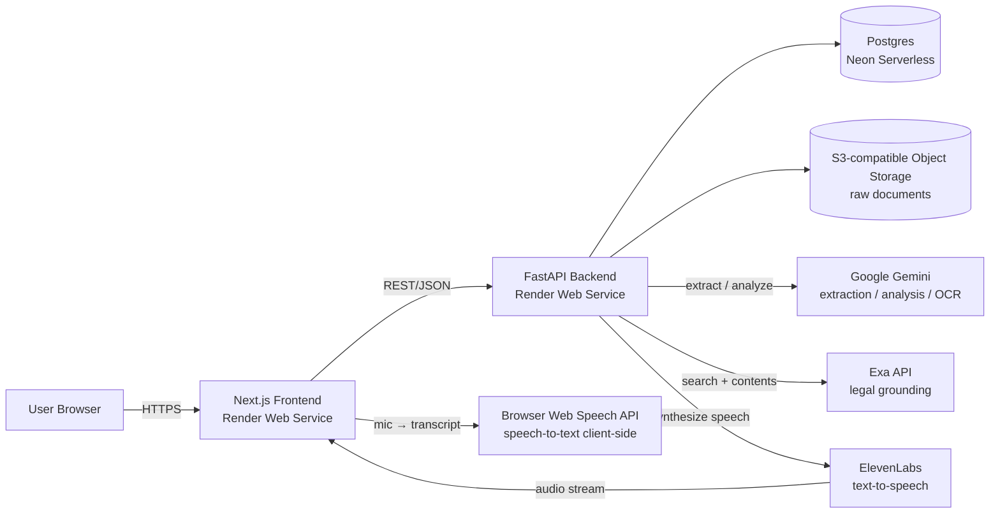
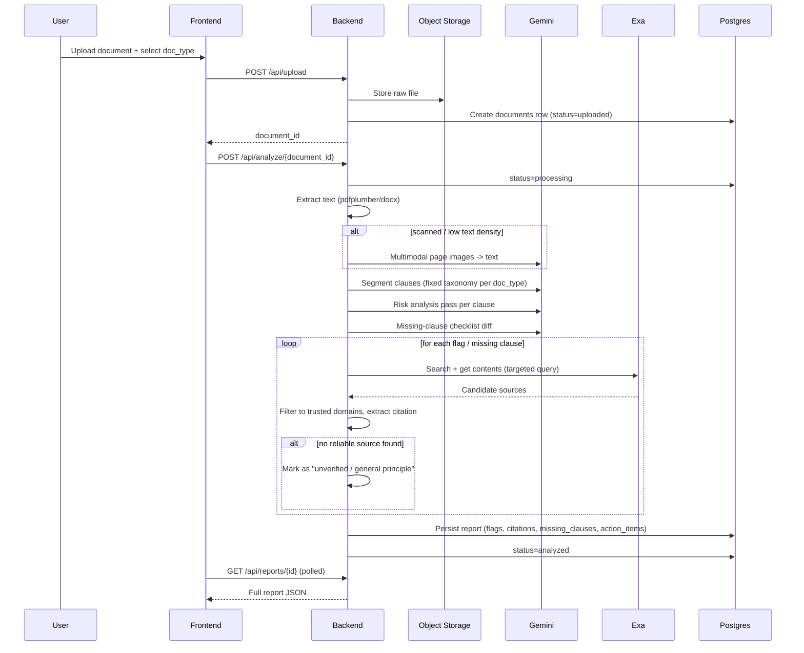
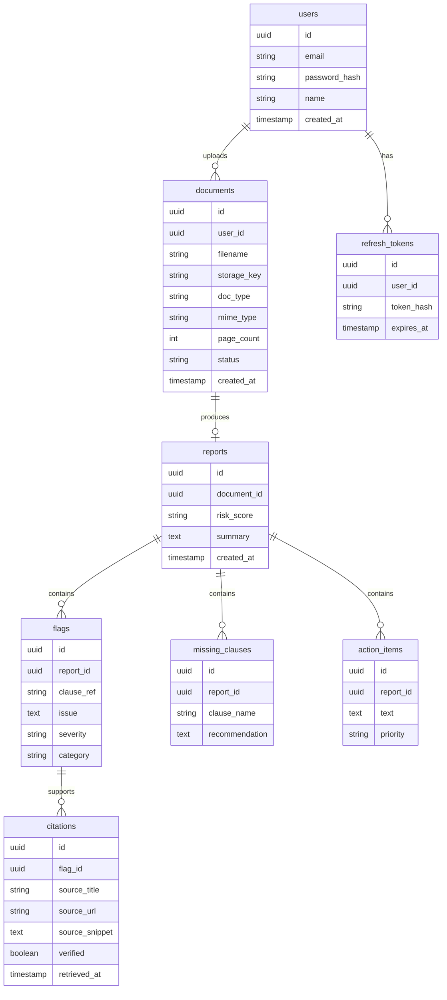

# Lexo — System Design

This document is the detailed companion to [`ARCHITECTURE.md`](./ARCHITECTURE.md). It specifies the architecture, data model, processing pipeline, API contract, security model, and deployment plan for Lexo.

Related docs: [`PRD.md`](./PRD.md) — product requirements, personas, acceptance criteria. [`SECURITY_AND_ACCESS.md`](./SECURITY_AND_ACCESS.md) — implementer-facing security & access-control spec expanding on §7 below.

## 1. Overview & Goals

Lexo is an AI-powered legal document assistant that helps everyday people understand rental and employment agreements before they sign them. A user uploads a document; Lexo extracts and classifies clauses, flags risky or unusual terms, identifies missing protections, and produces a plain-language risk report — grounded in real citations to Indian law, not hallucinated ones.

**Core design principles:**

- **Grounded, not generative, citations.** Every legal citation shown to a user must come from a real source retrieved via Exa. If no reliable source can be found for a claim, the report must label it as an *unverified / general principle* rather than inventing a statute or section number.
- **Plain language first.** Every flag and missing clause must be explained in language a non-lawyer can understand, with the legal citation shown as supporting evidence, not as the primary explanation.
- **Not legal advice.** Every report and every API response carries an explicit disclaimer that Lexo provides informational analysis, not a substitute for a lawyer.
- **Accessible beyond text.** Voice input (browser Web Speech API) and voice output (ElevenLabs) let users who are less comfortable reading dense text still use the product.
- **Privacy-respecting persistence.** Accounts and documents are persisted so users can revisit past reports, but access is strictly per-user, storage is encrypted, and users can delete their data at any time.

## 2. High-Level Architecture

**Why this shape:**

- Render hosts the frontend and backend as separate web services; structured data lives on Neon Serverless Postgres (external to Render) so the DB stays available across deploys without tying persistence to Render disks.
- Object storage is external (S3-compatible, e.g. Cloudflare R2 or AWS S3) because Render's own disks are not durable/shared across instances or redeploys, and uploaded contracts must survive restarts and scale-outs.
- Gemini is used for both document understanding (including OCR of scanned pages via its native multimodal input) and the analysis/report generation, avoiding a separate OCR dependency like Tesseract.
- Exa sits strictly in a *grounding* role: it never generates the legal conclusion, it only supplies retrievable sources that the LLM's claims are checked against.

## 3. Component Breakdown

### 3.1 Frontend (`lexo/frontend`, Next.js 15 + React 19 + Tailwind)

| Area | Responsibility |
|---|---|
| Auth pages (`/login`, `/signup`) | Email/password auth against `/api/auth/*`, store access token, redirect to dashboard |
| Dashboard (`/dashboard`) | List of the user's past documents/reports with status and risk badge |
| Upload (`/upload`) | Doc-type selection (rental / employment), drag-and-drop file picker, calls `/api/upload` then `/api/analyze/{document_id}` |
| Status (`/documents/[id]`) | Polls `/api/documents/{id}` while processing, shows progress stages (extracting → analyzing → grounding) |
| Report (`/reports/[id]`) | Risk badge (green/yellow/red), flags with citations, missing clauses, action items, "Listen to summary" audio player (ElevenLabs), mic button for voice Q&A (browser Web Speech API) + typed question fallback |

### 3.2 Backend (`lexo/backend`, FastAPI)

Existing stub routers are extended into real functionality; no new top-level structure is required:

| Router | New responsibility |
|---|---|
| `routes/auth.py` *(new)* | Signup, login, refresh, logout — issues JWT access + refresh tokens |
| `routes/upload.py` | Accepts multipart file + `doc_type`, validates type/size, stores blob, creates `documents` row, returns `document_id` |
| `routes/analyze.py` | Triggers the processing pipeline (§4) as a background task; exposes status polling |
| `routes/reports.py` *(new)* | Fetches a persisted `Report` by id, scoped to the authenticated user |
| `routes/voice.py` | `/api/voice/speak` (TTS via ElevenLabs); `/api/voice/ask` (text question → grounded answer); `/api/voice/transcribe` remains **501** (unused — STT is client-side Web Speech) |

New service layer under `backend/services/` (proposed):

- `extraction.py` — text extraction (pdfplumber / python-docx) + scanned-page fallback via Gemini multimodal input
- `llm.py` — Gemini client wrapper: clause segmentation, risk analysis, missing-clause detection, voice Q&A answering
- `grounding.py` — Exa client wrapper: query generation per flag, trusted-domain filtering, citation extraction
- `voice.py` — ElevenLabs (TTS) client wrapper only; no server-side STT / no Wispr client
- `storage.py` — S3-compatible blob upload/download helpers

### 3.3 Storage

- **Postgres** (Neon Serverless) — all structured data: users, documents, reports, flags, citations, missing clauses, action items, refresh tokens. Connection via `DATABASE_URL` (pooled string from the Neon console, `sslmode=require`).
- **Object storage** (S3-compatible) — raw uploaded files, addressed by `storage_key` on the `documents` row. Server-side encryption enabled; access only via short-lived signed URLs generated by the backend, never exposed directly to the client.

## 4. Document Processing Pipeline

**Stage detail:**

1. **Upload + validation** — enforce file type (`pdf`, `docx`) and size limits; `doc_type` (`rental` | `employment`) selects which clause taxonomy and missing-clause checklist apply downstream.
2. **Text extraction** — `pdfplumber`/`python-docx` for digital documents. If extracted text density is below a threshold (heuristic for scanned pages), page images are rendered and passed directly to Gemini's multimodal input for OCR + understanding in one pass — no separate OCR engine.
3. **Clause segmentation** — Gemini splits the document into typed clauses (e.g. rent amount, security deposit, notice period, termination, indemnity, non-compete) using a fixed taxonomy per `doc_type`.
4. **Risk analysis** — Gemini evaluates each clause against known risk patterns (e.g. security deposit exceeding Model Tenancy Act guidance, one-sided termination rights, unreasonable non-compete under Indian Contract Act §27) and produces a plain-language issue description + severity.
5. **Missing-clause detection** — presence/absence diff against a per-`doc_type` checklist:
   - *Rental:* deposit refund timeline, notice period, lock-in period, maintenance responsibility, subletting rights.
   - *Employment:* notice pay, non-compete/non-solicit reasonableness, termination cause, statutory benefits (PF/gratuity mention).
6. **Legal grounding (Exa)** — for every flag and missing clause, generate a targeted search query, call Exa search + contents, filter results to trusted domains (`indiacode.nic.in`, `indiankanoon.org`, government/ministry sources), and attach the citation snippet + URL. If no source clears the confidence bar, the item is explicitly labeled unverified rather than given a fabricated citation — this is the core anti-hallucination guardrail.
7. **Aggregation** — flags are rolled up into an overall `risk_score` (green/yellow/red), and the full `Report` is persisted.
8. **Optional voice** — ElevenLabs converts the report summary to speech on demand; the browser Web Speech API transcribes spoken questions client-side (user may also type). The frontend sends the **text** question to the backend; Gemini answers using the analyzed document + its citations as grounding context (no new information introduced beyond what's already in the report). No server-side STT.

**Async execution:** MVP uses FastAPI `BackgroundTasks` triggered from `/api/analyze/{document_id}`, with the frontend polling `/api/documents/{id}` for status. If load requires it later, this can graduate to a Celery + Redis (or Render Background Worker) queue without changing the API contract.

## 5. Data Model

This extends the current `Report`/`Flag` Pydantic models in [`backend/models/schemas.py`](../backend/models/schemas.py) with `document_id`, `summary`, `created_at`, and a nested `citations` list per flag (each citation carrying a `verified` boolean rather than a bare citation string), plus the new `users`/`refresh_tokens` tables required for accounts.

## 6. API Contract

| Method & Path | Purpose | Auth |
|---|---|---|
| `POST /api/auth/signup` | Create account | No |
| `POST /api/auth/login` | Issue access + refresh tokens | No |
| `POST /api/auth/refresh` | Rotate access token | Refresh token |
| `POST /api/auth/logout` | Revoke refresh token | Yes |
| `POST /api/upload` | Upload file + `doc_type`, returns `document_id` | Yes |
| `GET /api/documents` | List current user's documents | Yes |
| `GET /api/documents/{id}` | Status/progress of a document | Yes |
| `DELETE /api/documents/{id}` | Delete document + blob + associated report (right-to-delete) | Yes |
| `POST /api/analyze/{document_id}` | Kick off the processing pipeline | Yes |
| `GET /api/reports/{id}` | Fetch full structured report | Yes |
| `POST /api/voice/transcribe` | **Unsupported (501)** — STT is client-side Web Speech; do not send audio here | Yes |
| `POST /api/voice/ask` | Text question in → grounded answer (Gemini; report-scoped) | Yes |
| `POST /api/voice/speak` | Text in → audio out (ElevenLabs) | Yes |
| `GET /health` | Liveness check | No |

All authenticated endpoints scope queries by the requesting user's id; a user can never read or delete another user's documents or reports.

## 7. Auth & Security

- **Authentication:** JWT access tokens (short-lived, ~15 min) + refresh tokens (longer-lived, stored hashed in `refresh_tokens`), issued via `passlib`-hashed password verification.
- **Transport security:** HTTPS enforced end-to-end (Render terminates TLS at the edge for both services).
- **Storage security:** object storage uses server-side encryption at rest; the backend never returns raw storage URLs to the client, only short-lived signed URLs when needed.
- **Data isolation:** every query in `documents`, `reports`, `flags`, etc. is filtered by the authenticated `user_id`; enforced at the service layer, not just the route layer.
- **Right to delete:** `DELETE /api/documents/{id}` removes the blob, the document row, and cascades to its report/flags/citations.
- **Rate limiting:** upload and analyze endpoints are rate-limited per user to control LLM/Exa cost exposure and abuse.
- **Disclaimer:** every report payload and the report UI surface an explicit "This is not legal advice" notice.

## 8. Deployment (Render)

| Piece | Render resource |
|---|---|
| Frontend (`lexo/frontend`) | Web Service (Node, `next build` / `next start`) |
| Backend (`lexo/backend`) | Web Service (Python, `uvicorn main:app`) |
| Database | Neon Serverless Postgres (external; set `DATABASE_URL` on the Render backend service) |
| Object storage | External S3-compatible bucket (Cloudflare R2 / AWS S3) — not a Render-native resource |
| Secrets | Render environment groups shared across services (`GEMINI_API_KEY`, `EXA_API_KEY`, `ELEVENLABS_API_KEY`, `DATABASE_URL` from Neon, JWT signing secret, object storage credentials). `WISPR_API_KEY` is unused (STT is browser Web Speech). |
| Health checks | Existing `GET /health` on the backend |
| Async jobs (future) | Render Background Worker, only if/when the pipeline graduates from `BackgroundTasks` to a real queue |

## 9. Config Changes Required (Follow-up Implementation, Not Done in This Step)

To align the existing scaffold with the decisions above, a future implementation pass should:

- Rename `LLM_API_KEY` → `GEMINI_API_KEY` in [`backend/.env.example`](../backend/.env.example) and [`frontend/.env.local.example`](../frontend/.env.local.example).
- Add to [`backend/requirements.txt`](../backend/requirements.txt): `google-generativeai`, `pdfplumber`, `python-docx`, `pyjwt`, `passlib[bcrypt]`, `boto3` (or the SDK matching the chosen S3-compatible provider).
- Add `JWT_SECRET`, object-storage credentials (`S3_ENDPOINT`, `S3_ACCESS_KEY`, `S3_SECRET_KEY`, `S3_BUCKET`) to `.env.example`.
- Extend `backend/models/schemas.py` with `User`, `Document`, `Citation` models matching §5.

## 10. Phased Build Plan

| Phase | Scope |
|---|---|
| **1 — Foundation** | Auth (signup/login/JWT), upload endpoint, object storage integration, `documents` table, dashboard shell |
| **2 — Core analysis** | Text extraction + Gemini clause segmentation + risk analysis + missing-clause checklist, report persistence, report UI |
| **3 — Grounding** | Exa integration, trusted-domain filtering, citation persistence, unverified-claim labeling |
| **4 — Voice** | ElevenLabs TTS for report summaries; browser Web Speech API (client-side STT) + typed fallback for voice Q&A grounded in the report |
| **5 — Deployment & hardening** | Render deployment of FE/BE + Neon Postgres (`DATABASE_URL`), rate limiting, delete/retention flows, disclaimers, monitoring |

## 11. Voice / STT decision (resolved — TKT-027)

- **Wispr Flow is not used.** There is no server-side STT and no `WISPR_API_KEY` requirement.
- **Speech-to-text = browser Web Speech API** (`SpeechRecognition` / `webkitSpeechRecognition`) on the frontend. Chrome is the demo browser. Users may also type the question.
- `POST /api/voice/transcribe` stays as an explicit **501** documenting the client-side path; the frontend never depends on it for the demo.
- Voice Q&A sends **text** to `POST /api/voice/ask` (TKT-030); TTS remains `POST /api/voice/speak` (ElevenLabs).
